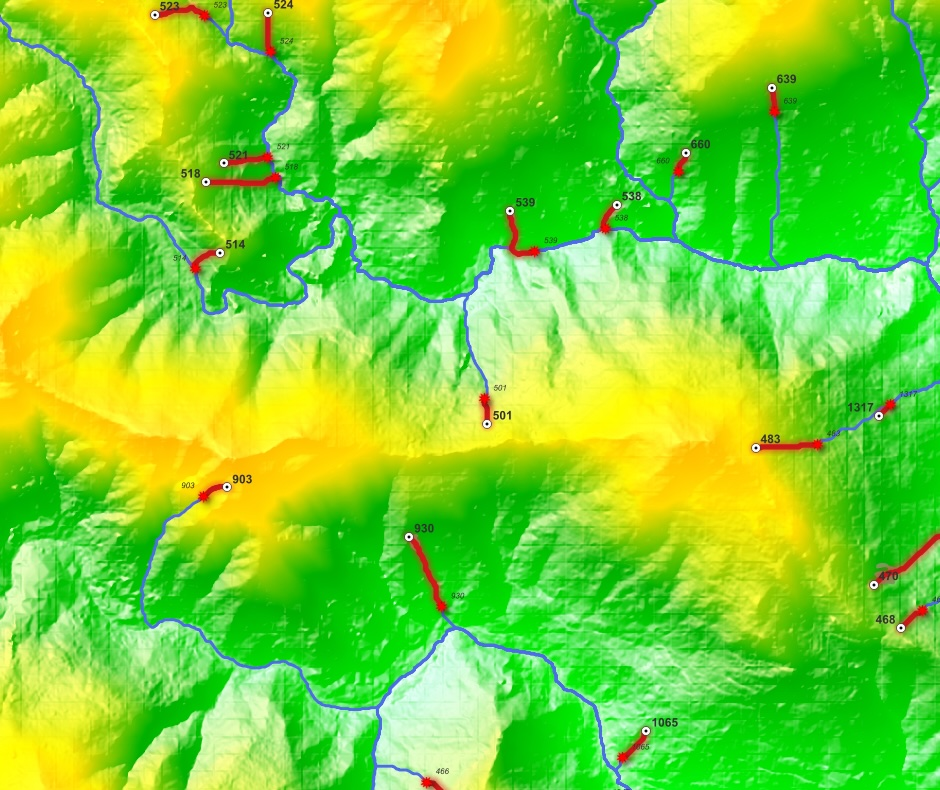
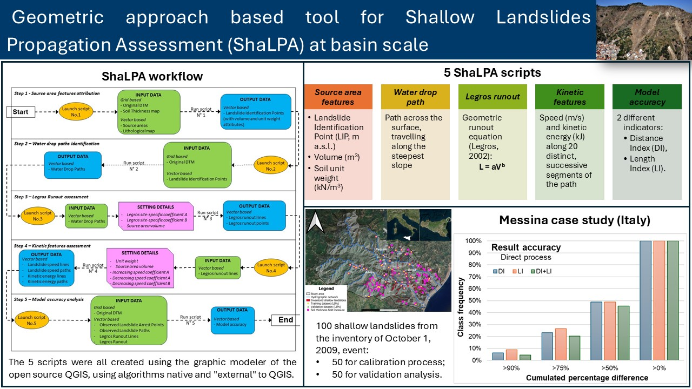
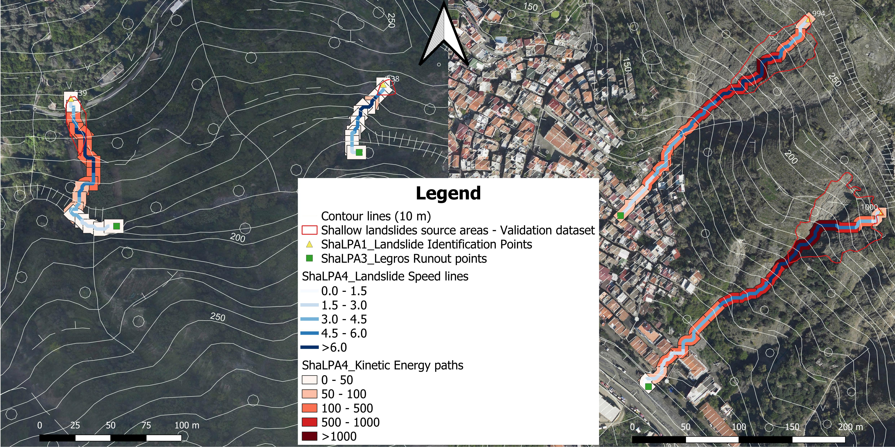

# ShaLPA
<strong>ShaLPA tool - Shallow Landslides Propagation Assessment at basin scale</strong>

Hazard maps for shallow landslides at the basin or regional scale often provide information solely about past events (inventory maps) and/or potential source areas (initiation susceptibility maps). Despite the availability of several propagation assessment software tools, runout maps that estimate the propagation areas of potential shallow landslides at basin scale are very rare. To fill this gap, the ShaLPA runout GIS tool was developed as an easy-to-use and efficient solution. This tool is based on a geometric approach, that relates one or more dimensional characteristics of a shallow landslide to the maximum runout of the mobilized material.

The ShaLPA GIS tool was tested for the first time in the Giampilieri and Briga area (Sicily, Italy), allowing the identification of strengths and weaknesses in the process and leading to improvements in the structure of the scripts. The application leverages the capability of the free QGIS software to automate the data processing required for the runout analysis. The scripts used by the runout GIS tool primarily manage a detailed DTM and basic geotechnical data, drawing the paths along which shallow landslides may move. The model estimates the maximum distance reached by the mobilised material (runout) and describes the distribution of velocity and kinetic energy along the path.

	

The reliability assessment was conducted by comparing observed and estimated runout values, providing encouraging results. The simplicity of using the ShaLPA tool promotes the integration of runout and failure susceptibility analyses, enhancing the completeness of hazard and risk assessment and improving the effectiveness of landslide mitigation measures.

# Using ShaLPA Tool 

To use these models, you must have QGIS 3.32 or later with the GRASS and SAGA tools in any operating system, Windows, MacOS or Linux. 
The latest distribution of QGIS includes both, GRASS and SAGA tool. The SAGA tool, in the latest versions of QGIS, needs the installation of a “Processing Saga NextGen Provider” plugin. Read the help inside the model.  

	
	<strong>ShaLPA Tool - Flowchart</strong>

To open models within your project:
- create your QGIS project;
- inside QGIS select “Toolbox” from the “Processing” menu;
- in the “Processing Toolbox” window, select “Open Existing Model...” to open the model file.

The starting model of the tool is “ShaLPA1 - SOURCE AREA FEATURES.model3” which requires:

- DTM of your area (a raster file);
- the Soil Thickness Map of your area (a raster file);
- the Lithological Map of your area (a vector file with polygons);
- Sources Areas of your area (a vector file with polygons).

The outputs of this model are used for the following Shalpa2 model, the outputs of ShaLPA2 are used for ShaLPA3 model and so on. 
Within each model there is a very detailed HELP.

Of course, you can also edit the model according to your needs. You can use it in any of your projects.

# Demo Data

The landslide inventory used in this study is available in "ShaLPA_Demo_Data.zip": 3 shape files for calibration and 3 shape files for validation (SourceAreas, LandslidePaths and LandslideArrestPoints). 

The 2 m cell size DTM (ATA flight 2012-2013), used in the study as basis for the morphometric analysis, is provided by Sicilian Regional Authorities (https://www.sitr.regione.sicilia.it/geoportale/it/Metadata/Details/946). 

The high-resolution aerial images (tiff format) used to implement the landslides inventory was provided by the Regional Civil Protection Department of Sicily.

The geotechnical map (shp format) was produced starting from the 1:50,000 geological map of the Messina province and the CARG geological map "601 - Messina-Reggio" (issued by ISPRA: https://www.isprambiente.gov.it/Media/carg/601_MESSINA_REGGIO/Foglio.html). The geotechnical report of the General Master Plan of the Messina Municipality (Comune di Messina - Piano regolatore generale - Variante parziale di tutela ambientale. Elaborato: relazione geologica – Giugno 2015/Aggiornato Febbraio 2017) was used to identify the unit weight of the formations present in the geological maps.   

The Soil Thickness Map ("ShaLPA_Demo_Data_SoilThicknessMap.tif") was produced using the GIST model approach described in Catani et al., 2010 (https://doi.org/10.1029/2008WR007450) and the specific process details are described in Falconi et al. 2023 (https://doi.org/10.1007/s11069-023-05945-8).

Demo Data - The Demo data required to run the model “ShaLPA1 - SOURCE AREA FEATURES.model3” are:
- DTM of the area (2 m cell size - see above where you can download it);
- the Soil Thickness Map ("ShaLPA_Demo_Data_SoilThicknessMap.tif");
- the Lithological Map (see above where you can download it);
- Sources Areas (in "ShaLPA_Demo_Data.zip" there is 'SourceAreas_validation' file ).

	
	<strong>ShaLPA Tool - Output of ShaLPA4</strong>

